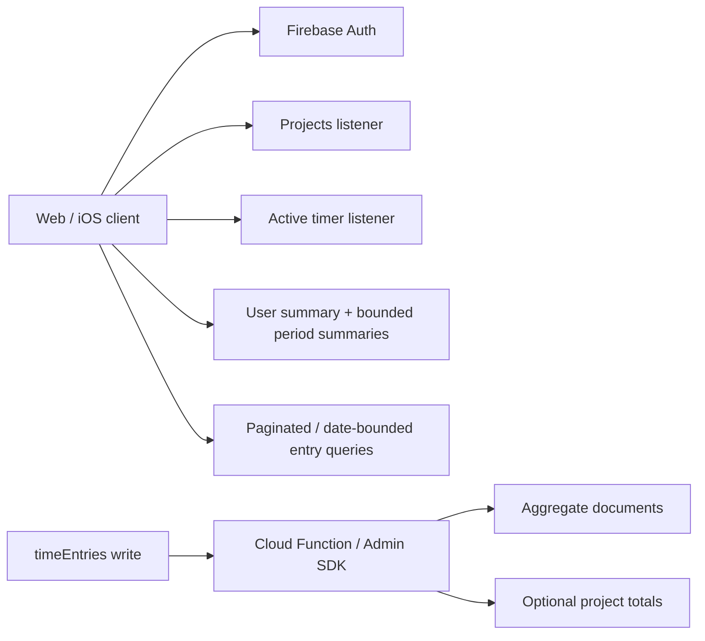

# Firestore Scaling and Aggregation Plan

## Implementation status (July 2026)

The aggregation foundation is now implemented in this repository, but must still
be deployed to the Firebase project and backfilled before the web dashboard can
read it. `functions/src/index.ts` contains a 2nd-generation Firestore
`onDocumentWritten` worker for `timeEntries/{entryId}`. It maintains the
following user-scoped documents:

```text
users/{uid}/summaries/overview
users/{uid}/dailySummaries/{YYYY-MM-DD}
users/{uid}/projectSummaries/{projectId}
```

The worker uses a transaction and the private `aggregateEvents/{eventId}`
ledger to make delivery retries idempotent. Aggregate documents are readable by
their owner and cannot be written by a client under `firestore.rules`.

Version 1 buckets daily data in UTC. This is intentional and documented in the
implementation so every client calculates the same day. A future reporting-timezone
feature requires a schema version bump and backfill; it must not silently change
the meaning of existing daily documents.

Completed sessions are counted once on the UTC date of their end time; duration
is still split across all UTC days they span. This is only semantically aligned
with the legacy dashboard for a user reporting in UTC. The current web UI uses
the browser's local timezone, so a future summary-based UI must either use UTC
throughout or introduce an explicit per-user IANA reporting timezone and
backfill to a new schema version.

The historical backfill command is implemented at `functions/src/backfill.ts`.
It rebuilds one user's aggregate documents from their existing `timeEntries`.
Run it only while that user is not creating or editing entries; it deliberately
replaces their daily/project/overview summaries with a fresh computation.

Not implemented yet: the client provider/store refactor, summary subscriptions
in the dashboard, pagination/range queries, and single-active-timer enforcement.
Until the client switch is done, the existing web UI continues to use its legacy
full-history listener.

## Decision

Replace dashboard-wide entry scans with server-maintained aggregate documents, and refactor clients so there is one shared data subscription layer per signed-in user. Use Cloud Functions/Cloud Run with the Firebase Admin SDK as the authoritative aggregation writer; do not let arbitrary clients update totals directly.

This preserves the product's current statistics while changing a dashboard load from “read every historical entry” to a small fixed number of aggregate/project/active-timer reads.

## Why the current design will become expensive

`subscribeToTimeEntries(uid)` listens to every matching document in the global `timeEntries` collection. Dashboard stats, pinned-project lifetime totals, history, charts, and calendar all derive from that full in-memory array. Initial listener delivery reads every matching document; any changed matching document causes another listener document read.

There is also a multiplier in the current React structure: `useTimeTracking()` creates three listeners (projects, all entries, active entry). It is invoked by pages and by many child cards/components. For example, a dashboard with *P* project cards can create roughly `1 + P` independent all-entry listeners, plus matching project and active-entry listeners. This can materially increase Firestore reads even before a user has much history.

At 20 users, cost depends on entries per user, session length, dashboard visits, and concurrent listeners—not simply the user count. The problematic growth is proportional to historical entry count per client screen and can become quadratic-looking at the UI level when repeated subscriptions are mounted.

## Target architecture



### Implemented collection layout

The existing top-level collections can remain during migration. Add aggregate documents scoped by user:

```text
users/{uid}/summaries/overview
users/{uid}/dailySummaries/{YYYY-MM-DD}
users/{uid}/projectSummaries/{projectId}
aggregateEvents/{eventId} // private trigger idempotency ledger
```

Suggested fields:

| Document | Suggested fields | Primary use |
| --- | --- | --- |
| `overview` | `completedSessionCount`, `completedDurationSeconds`, `projectCount`, `pinnedProjectCount`, `updatedAt`, `schemaVersion` | All-time headline values. |
| daily summary | `dateKey`, `completedSessionCount`, `durationSeconds`, `byProject.{projectId}.{completedSessionCount,durationSeconds}`, `updatedAt`, `schemaVersion` | Dashboard week totals, chart data, calendar day metadata. |
| project summary | `projectId`, `completedDurationSeconds`, `completedSessionCount`, `updatedAt`, `schemaVersion` | Pinned/project cards without downloading all project entries. |
| event ledger | `processedAt`, `schemaVersion` | Private record that prevents a retried trigger from applying its delta twice. |

Weekly summaries remain an optional optimization. Version 1 intentionally sums
the bounded daily documents instead of creating another write on every entry
mutation.

Keep durations as integer seconds or milliseconds, never rounded display minutes. Round only when displaying to users. `projectCount` and `pinnedProjectCount` may be maintained in `overview` or read from the usually small projects listener; maintaining them is optional.

## Write model and correctness

### Authoritative aggregation flow

1. The client performs its normal create, update, or delete of a time entry.
2. A trusted Firestore trigger receives the before/after document images.
3. The trigger calculates each entry's completed-duration contribution and applies the delta to all affected summary buckets in an Admin SDK transaction or batched write.
4. The client reads summary documents; it never writes aggregate fields.

For an entry, contribution is zero when it is active or lacks an end time; otherwise it is `endTime - startTime`. On update, subtract the old completed contribution/buckets and add the new ones. This correctly handles edits to project, start/end time, completion status, or dates. On delete, subtract the previous contribution. On creation, add the new contribution.

If an entry crosses midnight, the implemented worker splits its duration across
the applicable UTC daily buckets. Use one defined reporting timezone for
bucketing and document it. UTC is the current definition because there is no
user profile/timezone document yet. A future user-configured reporting timezone
must be introduced with a new schema version and backfill.

### Active timers

Do not continuously write aggregate time while a timer runs. Keep the existing active-entry document and calculate its live display on the device. When the timer stops, a single entry update creates the completed-duration aggregate delta. Dashboard summaries should expose completed totals; add the live active elapsed duration in the client only where the UI needs it.

### Concurrency, retries, and idempotency

Firestore triggers are at-least-once and may be delivered out of order. The aggregation worker must be idempotent. A robust implementation records an event ID/version in a processed-events collection or uses an outbox/event ledger transaction before applying aggregate deltas. Do not assume a trigger runs exactly once.

Use transactions for low-frequency per-user summary updates. If a single user could produce sustained high write rates, shard hot counters (for example, 10–20 shards) and read/sum the shards; normal personal time tracking will not need this initially.

## Read strategy by screen

| Screen / need | Target reads | Avoid |
| --- | --- | --- |
| Dashboard: current week duration and sessions | One weekly summary, or seven daily summaries; plus active timer listener | All historical entries. |
| Dashboard: project/pinned counts | Existing projects listener or `overview` summary | Entry scan. |
| Pinned project cards: lifetime totals | One project-summary query/listener for pinned projects, or totals embedded in project docs by trusted backend | Filtering all entries per card. |
| Time-entry history | Query `userId`, `startTime >= lowerBound`, `orderBy(startTime desc)`, `limit(pageSize)`; use cursor pagination | Load all records, then filter locally. |
| Calendar | Date-overlap queries for visible range; use daily summaries for header totals/colors | Entire history to render one week. |
| Time breakdown chart | Period summary's `byProject`, or bounded entry query when exact detail is required | Aggregating unbounded history in the browser. |

The active-timer query should include `limit(1)` and the data model should ensure only one active timer. Prefer a dedicated `users/{uid}/state/currentTimer` document as the single canonical active-timer pointer if the app is refactored to user-scoped data.

## Required client refactor

Create one `TimeTrackingProvider`/store near the authenticated application root. It owns the current user's project listener, active-timer listener, and only the summaries required by the current screen. Components consume state/actions from that provider; they must not each call a hook that creates Firestore listeners.

Then separate data APIs by use case:

- `subscribeProjects(uid)` — all projects is normally a small collection.
- `subscribeCurrentTimer(uid)` — one document/query only.
- `subscribeWeeklySummary(uid, weekKey)` — dashboard metric.
- `fetchEntriesPage(uid, filters, cursor)` — history.
- `subscribeEntriesForRange(uid, range)` — calendar only, bounded by visible dates.
- `subscribeProjectSummaries(uid, projectIds)` — pinned cards.

Ensure all listeners unsubscribe on user change/navigation, debounce calendar range changes, and cache already-loaded pages/ranges in the app store.

## Query/index changes

At minimum, use server-side ordering in current/future entry queries:

```text
where(userId == uid)
where(startTime >= rangeStart)
where(startTime < rangeEnd)
orderBy(startTime, desc)
limit(pageSize)
```

The existing `userId + startTime DESC` composite index supports this shape. Maintain/add indexes only after validating actual query requirements in Firestore's generated index links. For a per-project history view, the existing `userId + projectId + startTime DESC` index is appropriate.

Firestore cannot express a single efficient overlap query for entries where `startTime <= rangeEnd AND endTime >= rangeStart` without tradeoffs. For the calendar, query entries by `startTime` in a bounded range and include a small lookback for entries that began before the view; alternatively maintain day-assignment records/summaries in the backend. This is another reason daily summaries are valuable for calendar headers.

## Security rules and schema hardening

Clients have no write access to aggregate documents. The checked-in rules allow
each user to read only their `users/{uid}/summaries`, `dailySummaries`, and
`projectSummaries` documents. The Admin SDK worker bypasses Firestore rules;
the private event ledger remains inaccessible to clients.

As a separate improvement, add backend validation/enforcement for:

- the referenced project existing and belonging to the same user;
- a non-active entry having `endTime > startTime`;
- at most one active timer per user; and
- a project deletion strategy (block deletion, soft delete, or trusted cascade/archive).

## Alternatives considered

| Option | Benefits | Limitations | Recommendation |
| --- | --- | --- | --- |
| Firestore `count()` / aggregation queries | No denormalized writes; useful for occasional counts. | Does not provide summed duration, per-project breakdowns, or live dashboard aggregates; still has query/index cost. | Use only for occasional counts, not this dashboard. |
| Client-maintained totals | Quick to implement. | Clients can tamper, disconnect mid-write, race, and double-update; rules cannot safely validate arbitrary totals. | Do not use as the source of truth. |
| Aggregate fields on project documents | Very cheap pinned-card reads. | Requires trusted delta updates and does not solve period dashboards by itself. | Good supplement to user daily/weekly summaries. |
| Cloud Functions/Cloud Run aggregate documents | Fast bounded reads, secure, cross-platform, supports periods/charts. | More backend implementation and trigger correctness work. | Recommended. |
| Export to BigQuery / analytics warehouse | Excellent for long-term analytics. | Not suitable as the primary live in-app dashboard and adds operational complexity. | Add later for reporting, if needed. |

## Migration and rollout plan

1. **Measure first.** Enable Firebase usage/budget alerts and inspect Firestore read counts by screen. Instrument listener creation in development to verify the duplicate-listener fix.
2. **Deploy the implemented worker and rules.** From the repository root, run `npm --prefix functions ci` followed by `firebase deploy --only functions:aggregateTimeEntry,firestore:rules`. The checked-in Functions predeploy hook compiles TypeScript before upload. The worker must be deployed before any client consumes aggregates.
3. **Backfill historical entries.** Authenticate local Application Default Credentials with `gcloud auth application-default login`, then run `npm --prefix functions run backfill -- --uid <Firebase Auth UID>`. This rebuilds that user's aggregate documents and stamps them with `backfilledAt` and `schemaVersion`. Do not run it concurrently with that user's entry writes.
4. **Stop duplicate listeners.** Introduce the root data provider before switching screens; this yields an immediate read reduction with low data risk.
5. **Dual-read validation.** For a limited set of users, compute dashboard values both ways and log/report mismatches. Keep the all-entry calculation only as a temporary verification path.
6. **Switch the dashboard and pinned cards.** Read summaries, use bounded history/calendar queries, and remove the full-history listener from ordinary screens.
7. **Tighten invariants.** Add current-timer enforcement and choose the project-deletion policy. Remove legacy fallback only after metrics and comparisons are stable.

## Success criteria

- Opening the dashboard never reads the user's full `timeEntries` history.
- A dashboard uses a fixed, small number of documents regardless of historical entry count.
- A single screen creates one shared listener per required data stream, not one per component/card.
- Completed-duration totals remain correct after create, stop, edit, delete, project reassignment, and retry.
- History and calendar reads are bounded to the selected page/date range.
- Aggregate documents cannot be modified by an untrusted client.
