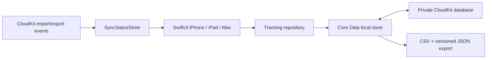

# iCloud-First Native Plan

**Status:** Proposed
**Scope:** iPhone, iPad, and macOS only. The existing web app and all Firebase
code are explicitly out of scope for this plan.

## Decision

Launch as an offline-first Apple app whose data lives in the person's private
iCloud database. Do not add Firebase Authentication, Firestore, Cloud
Functions, or a custom backend before launch.

The app will use Core Data backed by `NSPersistentCloudKitContainer` rather
than managed SwiftData CloudKit sync. SwiftUI remains the UI framework. This is
a data-layer choice: Core Data gives us the CloudKit import/export events needed
to present a useful, honest sync status and diagnose failures. SwiftData's
managed CloudKit integration is excellent for simple automatic sync, but does
not expose an equivalent public sync-progress or "sync now" interface.

This is not a permanent commitment to Apple-only storage. The domain model,
repository APIs, stable IDs, and export format will keep a future custom cloud
possible without rewriting the app UI.

## Product behavior at launch

The following launch features work without any Firebase service:

- Projects/commitments, pinned projects, running timers, manual entries, edit
  and deletion.
- Week timeline, weekly totals, history, and project breakdowns.
- Read-only EventKit calendar import, on-device matching rules, and a review
  queue before imported events become time entries.
- StoreKit 2 purchases, restore purchases, local preferences, CSV/JSON export,
  and deletion of all app data.
- Cross-device synchronization for a person signed into the same Apple Account
  on their iPhone, iPad, and Mac.

There is no app-specific login at launch. The Apple Account is used only by
iCloud; we do not collect an email address or create an application account.

## The sync promise we can honestly make

CloudKit synchronization is **eventual**, not a real-time distributed lock. A
device can be offline, backgrounded, signed out of iCloud, or deferred by the
operating system. Therefore we must never claim that a tap is instantaneously
visible everywhere.

Our promise is:

> Changes are saved immediately on this device, automatically uploaded to
> iCloud when the system permits, and automatically applied on the other signed
> in devices. The app always tells the person whether this device is current,
> uploading, waiting, or needs attention.

The app can confirm that **this device successfully exported a change to
iCloud** and that **this device successfully imported available CloudKit
changes**. It cannot prove that every other device is online or has already
processed the change. Copy must say “Uploaded to iCloud” or “Last checked,” not
“All devices are synced.”

Apple controls the timing of automatic Core Data/CloudKit transfers; there is
no supported API to force an immediate export or import. A true user-controlled
"Sync now" requires owning the CloudKit record layer with `CKSyncEngine` (or a
future custom backend), which is a much larger implementation and conflict
management responsibility. It is not part of v1.

## Cross-device timer correctness

### Required invariant

After a stopped timer reaches another device, it must never be rendered as
running there. A late local view must be visibly identified as stale until the
remote change is imported.

### Data design

Use a `TimeEntry` entity with a stable UUID and a monotonic lifecycle:

| Field | Purpose |
| --- | --- |
| `id` | Stable UUID for export and a future backend migration. |
| `projectID` | UUID reference, not a mandatory CloudKit relationship. |
| `startedAt` | Immutable start instant. |
| `endedAt` | `nil` only while running; once set, never set back to `nil`. |
| `state` | `running`, `stopped`, or `deleted`. A stop is terminal. |
| `createdAt`, `modifiedAt` | Auditing, ordering, and migration data. |
| `modifiedByDeviceID` | Diagnostics only; never display it as identity. |
| `revision` | Incremented for local edits; used for conflict diagnostics. |

Rules:

1. Stopping a timer writes `endedAt`, `state = stopped`, `modifiedAt`, and a new
   `revision` in one local transaction.
2. No UI or repository method may change a stopped entry back to `running`.
3. A device that has successfully imported the stopped record renders it as
   stopped immediately. Its elapsed-time ticker must be tied to `state`, not
   merely the absence of a currently selected timer.
4. Never overwrite a newer stopped entry with stale running data. The managed
   object merge policy and regression tests must make terminal stop state win.
5. If two devices start different timers while disconnected, retain both
   records and present a clear **Timer conflict** resolution screen after sync.
   Do not silently invent an end time or discard paid work.

### Current-timer UX

- On foreground, check iCloud account availability, refresh local UI after any
  imported changes, and display the last CloudKit event status.
- When starting or stopping, save locally first. Show `Saving to iCloud…` until
  the next successful export event; then show `Uploaded to iCloud` with time.
- When opening the active timer on a device whose last successful sync is old,
  show a compact warning: `May be out of date — waiting for iCloud`.
- If iCloud is unavailable, allow tracking locally but show `Saved on this
  device only` and never imply cross-device synchronization.
- Do not offer a fake refresh button. A `Check sync status` action may recheck
  iCloud account/network state and explain that syncing continues
  automatically; it must not promise a forced transfer.

## Sync status model

Create a `SyncStatusStore` owned by the app session. It is separate from the
time-tracking repository and publishes:

| State | Meaning | UI copy |
| --- | --- | --- |
| `localOnly` | iCloud unavailable/not signed in. | Saved on this device only |
| `idle(lastImport, lastExport)` | Most recent operations succeeded. | Uploaded to iCloud at 2:14 PM |
| `uploading` | Core Data export event in progress. | Saving to iCloud… |
| `receiving` | Core Data import event in progress. | Updating from iCloud… |
| `waiting` | Recent local changes have no completed export yet. | Waiting to sync |
| `error(retryable)` | A transfer failed; keep local data. | Sync needs attention |

Implementation inputs:

- `CKContainer.accountStatus()` at launch, on foreground, and after
  `CKAccountChanged`.
- `NSPersistentCloudKitContainer.eventChangedNotification` for setup, export,
  and import completion/errors.
- `NSPersistentStoreRemoteChange` to merge imported persistent history and
  refresh the SwiftUI-facing view context.
- Persistent local diagnostics for the last successful import/export timestamps,
  the last sync error category, and the number of local changes awaiting an
  export event.

The timestamps answer “when did this device last complete a CloudKit
operation?” They are operational status, not a proof that every device is
currently identical.

## Data architecture

### Entities for v1

- `Project`: UUID, name, color, pinned flag, created/modified timestamps,
  optional archived/deleted timestamp.
- `TimeEntry`: lifecycle fields defined above, optional description, project UUID.
- `CalendarRule`: local matcher fields and destination project UUID.
- `CalendarSuggestion`: source event identifier/hash, proposed project UUID,
  reviewed state, timestamps. Store only the minimum EventKit-derived data
  required for review.
- `AppPreference`: syncable preferences only when cross-device consistency is
  useful; keep presentation-only preferences local.

Use UUID references and explicit fetches rather than required/ordered Core Data
relationships. CloudKit schema processing is non-atomic for relationships, and
deletion must be explicit. Project deletion should archive the project or
require reassigning its entries; never cascade-delete time history by accident.

## Delivery phases

### Phase 0 — Project and CloudKit setup

1. Confirm the deployment targets support the chosen Core Data + CloudKit APIs.
2. Create one production CloudKit container, for example
   `iCloud.com.ammar.TimeTracker`, associated only with this app identifier.
3. Enable **iCloud / CloudKit** and **Background Modes / Remote notifications**
   on iOS, iPadOS, and macOS targets.
4. Maintain separate Development and Production schema workflows. Initialize
   and inspect the development schema, run real-device tests, then deploy the
   reviewed schema to Production before TestFlight.
5. Add a launch-time iCloud availability screen and local-only fallback.

### Phase 1 — Real local tracker and persistence

1. Replace sample `TTProject`/session state and the placeholder `Item` model
   with the production entities.
2. Introduce repository APIs: projects, entries, active timer, calendar review,
   summary queries, deletion, and export.
3. Implement all timer writes as atomic local persistence transactions.
4. Build bounded date/week queries; do not create a local copy of Firestore's
   server aggregation architecture.
5. Add migration-safe versioned JSON and CSV exports.

### Phase 2 — CloudKit sync and observability

1. Configure `NSPersistentCloudKitContainer` with the private database.
2. Implement `SyncStatusStore`, event observation, remote-change merging,
   foreground account checks, and user-facing status states.
3. Add a Settings > Sync screen with iCloud availability, last successful
   upload/download, pending/error state, plain-language help, and diagnostics
   export for support.
4. Verify all changes on physical iPhone, iPad, and Mac hardware using the same
   Apple Account. The simulator uses the development environment only.

### Phase 3 — Conflict-safe active timers

1. Enforce terminal stop transitions in the repository and merge policy.
2. Add stale-data messaging for an active timer and a conflict-resolution view
   for independently created offline timers.
3. Test offline start/stop/edit/delete sequences on two devices, then reconnect
   in varied orders.
4. Add automated tests for stopped-over-running resolution and no duplicate
   active timer UI state after import.

### Phase 4 — Calendar, launch safeguards, and product polish

1. Add EventKit permission education, import, matching rules, and review flow.
2. Add StoreKit 2, restore purchases, privacy policy, support path, and data
   export/deletion flows.
3. Add `Delete all app data`: delete local records and CloudKit-backed records
   after confirmation, then verify the result on another device. Because v1 has
   no app-created account, this is data deletion rather than Firebase-style
   account deletion.
4. Test TestFlight builds against the Production CloudKit schema before release.

## Test matrix and release gates

| Scenario | Required result |
| --- | --- |
| Stop on iPhone; Mac online | Mac imports stop and never displays that entry as running after import. |
| Stop on iPhone; Mac offline | Mac labels active state as potentially stale; it converges to stopped after reconnect/import. |
| Start two timers offline on two devices | Both survive; a conflict is shown after sync. No silent data loss. |
| iCloud signed out on one device | Tracking continues locally; cross-device-sync claims are disabled. |
| Temporary network loss | Local writes remain; status becomes waiting/error and recovers without user data loss. |
| Project archive/delete | Historical entries remain visible and exportable. |
| Upgrade with existing local data | One-time migration preserves IDs, history, and timer state. |
| Production/TestFlight build | Production CloudKit schema is deployed and sync works on physical hardware. |

Release is blocked until the first five scenarios pass repeatedly on a real
iPhone, iPad, and Mac.

## Future own-cloud migration

Keep these seams from day one:

- UI depends on repository protocols, not Core Data types.
- Every record has a stable UUID, timestamps, lifecycle state, schema version,
  and versioned export representation.
- No business logic depends on a CloudKit record name or Apple Account ID.
- Add a future `CustomCloudSyncProvider` beside—not inside—the repositories.

When a custom cloud is justified by web parity, non-Apple clients, collaboration,
or server-side reporting, ship an opt-in migration:

1. Export/import a versioned snapshot by stable UUID.
2. Verify record counts and content hashes locally.
3. Temporarily dual-write only after explicit user consent and visible recovery
   tools.
4. Retire CloudKit sync only after a measured migration period.

Do not build that backend before the native product has validated the weekly
reflection workflow.

## References

- [Syncing model data across a person's devices](https://developer.apple.com/documentation/swiftdata/syncing-model-data-across-a-persons-devices)
- [TN3164: Debugging the synchronization of NSPersistentCloudKitContainer](https://developer.apple.com/documentation/technotes/tn3164-debugging-the-synchronization-of-nspersistentcloudkitcontainer)
- [CloudKit account status](https://developer.apple.com/documentation/cloudkit/ckcontainer/accountstatus%28completionhandler%3A%29)
- [NSPersistentCloudKitContainer event notifications](https://developer.apple.com/documentation/coredata/nspersistentcloudkitcontainer/eventchangednotification)
- [CKSyncEngine automatic synchronization](https://developer.apple.com/documentation/cloudkit/cksyncengineconfiguration/automaticallysync)
